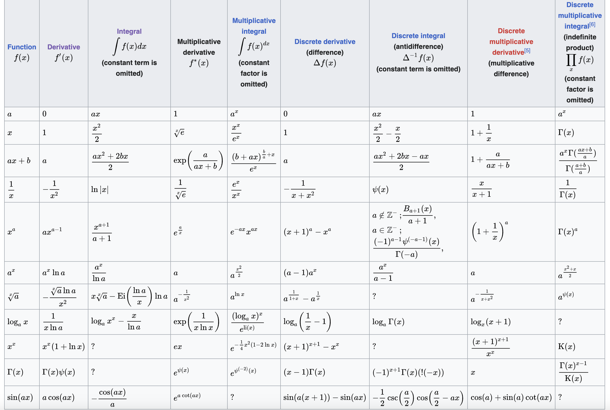

Calculus
===

## Goals

1) Intention of this repo to implement a showcase setup fo Calculus Derivatives and Integrals, so that to educate myself better and to have basic code implementation in **JavaScript** (maybe **Python**).
   - Especially in JavaScript there is many Math related functions, and I almost never use it.

2) My Math education is based on Ukrainian mathematical terms, so it's kinda hard for me sometimes to grasp mathematical terms in English.

And final inspiration to open tis repo was the [list of derivatives and integrals](https://en.wikipedia.org/wiki/List_of_derivatives_and_integrals_in_alternative_calculi). I like such tables because it gives a big picture of how all is related.

## Sources

[Wiki](https://en.wikipedia.org/wiki/Calculus) (Calculus aka Диференціальне та інтегральне числення): 

> Calculus is the mathematical study of continuous change, in the same way that geometry is the study of shape, and algebra is the study of generalizations of arithmetic operations.

> Originally called infinitesimal calculus or "the calculus of infinitesimals", it has two major branches, differential calculus and integral calculus. 

> In mathematics education, calculus denotes courses of elementary mathematical analysis, which are mainly devoted to the study of functions and limits. The word calculus is Latin for "small pebble" (the diminutive of calx, meaning "stone"), a meaning which still persists in medicine.

- https://en.wikipedia.org/wiki/Calculus 
https://en.wikipedia.org/wiki/Derivative (Похідна)
- https://en.wikipedia.org/wiki/Antiderivative (Первісна)
- https://en.wikipedia.org/wiki/Integral (Інтеграл та integrand function)
- https://en.wikipedia.org/wiki/Lists_of_integrals
- https://en.wikipedia.org/wiki/List_of_derivatives_and_integrals_in_alternative_calculi
- https://en.wikipedia.org/wiki/Mathematical_analysis (МатАналіз)
- https://en.wikipedia.org/wiki/Logarithmic_scale
